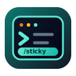

<div align="center">
  
  <h1>Codex Sticky</h1>
  <p>简体中文 | <a href="./README.md">English</a></p>
  <p><strong>面向终端优先工作流的 OpenAI Codex CLI 轻量增强版。</strong></p>
  <p>
    
    
    
  </p>
</div>

Codex Sticky 尽量贴近上游 Codex CLI，只补上长终端会话里最影响体验的一块：翻看较早 transcript 内容时，composer / 输入区域仍然可达。它适合 SSH、tmux、远程服务器和纯终端开发场景，并且默认与官方 `codex` 并存安装。

## 📰 News

2026-06-09 ⬆️ `0.138.0-sticky.1` 同步至 OpenAI Codex `0.138.0` / 上游标签 `rust-v0.138.0`，并保留 Sticky Transcript 补丁集。

2026-06-08 🖱️ `0.137.0-sticky.2` 增加底部 composer 鼠标拖选复制、sticky 鼠标事件分发和尽力而为的文本指针提示。

2026-06-05 📌 `0.137.0-sticky.1` 首次提供基于 Linux x86_64 GNU 的 Sticky Transcript 并存安装版本。

## ✨ 核心特性

- 浏览较早 transcript 内容时，保持 composer / 输入区域可达。
- 改善长对话中的终端交互体验。
- 更适合 SSH、tmux、远程服务器和纯终端开发。
- 安装为 `codex-sticky`，默认不覆盖官方 `codex`。
- 尽量贴近上游，保持薄补丁和低维护成本。

## 🎬 演示

【TODO：在 `docs/assets/readme/codex-sticky-demo.gif` 添加顶部终端演示 GIF】

【TODO：在 `docs/assets/readme/sticky-transcript-before-after.png` 添加 Sticky Transcript 前后对比图】

【TODO：在 `docs/assets/readme/tmux-ssh-demo-thumbnail.png` 添加 tmux / SSH 演示视频缩略图】

目前不引用不存在的图片，避免 GitHub 出现破图。

## 👤 适合谁

如果你符合下面任意情况，Codex Sticky 可能有帮助：

- 主要在终端里开发；
- 经常通过 SSH、tmux 或远程 Linux 服务器使用 Codex；
- 长对话里需要反复查看较早输出；
- 想要一个可以和官方 Codex CLI 并存的小增强，而不是替换官方工具。

## 🧭 当前支持范围与限制

当前正式版：`0.138.0-sticky.1`。

- `0.138.0` 表示基于 OpenAI Codex `0.138.0` / 上游标签 `rust-v0.138.0`。
- `-sticky.1` 表示这个上游版本上的第 1 个 Sticky 增强版本。

当前支持：

- Linux x86_64
- `x86_64-unknown-linux-gnu`
- 终端、SSH、tmux、远程服务器场景

当前暂不提供：

- macOS 预编译包
- Windows 预编译包
- Linux ARM64 预编译包
- musl 静态包
- 自动更新器

GNU 包依赖常规 Linux glibc 环境。Codex Sticky 可能滞后于 OpenAI Codex 最新版本；本项目会按阶段同步上游稳定版本，而不是追踪每一个上游提交。

## 🚀 快速开始

### 0. 先安装官方 Codex CLI

推荐流程：

1. 先安装并确认官方 OpenAI Codex CLI 可以正常运行。
2. 再安装 Codex Sticky。
3. 官方 `codex` 与 `codex-sticky` 可以并存。
4. 需要时分别运行 `codex` 或 `codex-sticky`。

本文不会详细重复官方 Codex CLI 安装步骤。请优先查看官方来源：

- OpenAI Codex 仓库：<https://github.com/openai/codex>
- 官方安装与构建文档：<https://github.com/openai/codex/blob/main/docs/install.md>
- OpenAI Codex 开发者文档：<https://developers.openai.com/codex>

### 方案 A：让 Codex 帮你安装

如果你已经能够运行官方 Codex CLI，可以直接把下面这段 prompt 交给 Codex，让它完成安装和验证：

```text
请帮我安装 codex-sticky。要求：
1. 不要覆盖或卸载现有官方 codex。
2. 从 Jurio0304/codex-sticky 最新正式 GitHub Release 下载 Linux x86_64 GNU 压缩包和 SHA256SUMS。
3. 校验 SHA256。
4. 解压并安装为 ~/.local/bin/codex-sticky。
5. 如 ~/.local/bin 尚未加入 PATH，告诉我应该如何配置，但不要未经确认修改 shell 配置。
6. 执行 codex-sticky --version 验证安装。
7. 最后报告官方 codex 与 codex-sticky 是否可以并存运行。
```

### 方案 B：使用一键安装脚本

更安全的审阅后安装方式：

```bash
curl -fsSL https://raw.githubusercontent.com/Jurio0304/codex-sticky/main/scripts/install.sh \
  -o install-codex-sticky.sh

less install-codex-sticky.sh
bash install-codex-sticky.sh
```

快捷方式：

```bash
curl -fsSL https://raw.githubusercontent.com/Jurio0304/codex-sticky/main/scripts/install.sh | bash
```

如果你希望先看清楚脚本内容，建议使用第一种方式。安装脚本会下载当前 Linux x86_64 GNU 包，校验 `SHA256SUMS`，并写入 `~/.local/bin/codex-sticky` 和 `~/.local/libexec/codex-sticky-bin`。它不会安装或覆盖名为 `codex` 的二进制。

如果要明确安装当前版本：

```bash
curl -fsSL https://raw.githubusercontent.com/Jurio0304/codex-sticky/main/scripts/install.sh \
  -o install-codex-sticky.sh
CODEX_STICKY_VERSION=0.138.0-sticky.1 bash install-codex-sticky.sh
```

### 方案 C：手动安装 Release 包

从下面的 Release 页面下载资产：

<https://github.com/Jurio0304/codex-sticky/releases/tag/0.138.0-sticky.1>

需要下载：

```text
codex-sticky-0.138.0-sticky.1-x86_64-unknown-linux-gnu.tar.gz
SHA256SUMS
```

校验并安装：

```bash
sha256sum -c SHA256SUMS

mkdir -p ~/.local/bin ~/.local/libexec
tar -xzf codex-sticky-0.138.0-sticky.1-x86_64-unknown-linux-gnu.tar.gz
install -m 755 codex-sticky ~/.local/bin/codex-sticky
install -m 755 libexec/codex-sticky-bin ~/.local/libexec/codex-sticky-bin
chmod 755 ~/.local/bin/codex-sticky

~/.local/bin/codex-sticky --version
```

如果 `~/.local/bin` 还不在 `PATH` 里，可以把下面内容加入你的 shell 配置：

```bash
export PATH="$HOME/.local/bin:$PATH"
```

### 方案 D：可选 alias

默认安装不会替换官方 Codex CLI。如果你明确希望当前 shell 中的 `codex` 启动 Codex Sticky，可以自行添加 alias：

```bash
alias codex='codex-sticky'
```

这是可选项。默认安装不会覆盖官方 `codex`。

## 🔀 运行与切换

运行官方 Codex CLI：

```bash
codex
```

运行 Codex Sticky：

```bash
codex-sticky
```

确认两个命令分别解析到不同位置：

```bash
which codex
which codex-sticky
codex --version
codex-sticky --version
```

临时切换时，直接选择本次会话要运行的命令即可。如果你设置了 alias，又想临时绕过 alias，可以使用 `command codex`，或在当前 shell 中取消 alias。

在 TUI 内，也可以为当前会话切换 Sticky Transcript：

```text
/sticky
/sticky on
/sticky off
/sticky status
```

## ⬆️ 更新

后续 Sticky 版本发布后，可以再次运行安装脚本：

```bash
curl -fsSL https://raw.githubusercontent.com/Jurio0304/codex-sticky/main/scripts/install.sh | bash
```

如果要安装指定 Sticky 版本，复用同一个脚本并设置 `CODEX_STICKY_VERSION` 即可。

当前没有自动更新器。新版本请查看 GitHub Releases：

<https://github.com/Jurio0304/codex-sticky/releases>

## 🧹 卸载

删除并存安装的二进制：

```bash
rm ~/.local/bin/codex-sticky
```

如果你额外配置过 alias，也需要从 shell 配置中移除。上面的卸载命令不会删除官方 `codex`。

## 🔄 与上游同步策略

Codex Sticky 的目标是尽量贴近 `openai/codex`，只保留少量终端工作流增强补丁。它不会追踪每一个上游提交，而是由维护者阶段性选择上游稳定版本，审阅差异，并在补丁集准备好后发布 Sticky 修订版。

这样可以保持项目轻量，但也意味着 Codex Sticky 可能暂时落后于 OpenAI Codex 最新版本。

## ❓ 常见问题

### 1. 会覆盖官方 `codex` 吗？

不会。安装脚本写入的是 `~/.local/bin/codex-sticky` 和 `~/.local/libexec/codex-sticky-bin`，不会安装或覆盖名为 `codex` 的二进制。

### 2. 为什么建议先安装官方 Codex CLI？

Codex Sticky 是小增强，不是完整替代品。先安装并验证官方 Codex，可以确认账号、认证、模型访问和基础 CLI 工作流都正常，再添加这个并存二进制。

### 3. 为什么目前只提供 Linux x86_64 GNU 包？

第一个正式版本优先覆盖本项目最关注的环境：终端、SSH、tmux 和远程 Linux 服务器。macOS、Windows、ARM64、musl 以及更复杂的发布自动化会等到维护成本可控时再考虑。

### 4. 为什么 `codex-sticky --version` 显示 `codex-sticky 0.138.0-sticky.1`？

安装后的命令会包装基于上游的二进制，让命令版本与 Sticky release tag 保持一致。底层 Rust workspace 版本仍跟随上游 Codex CLI 基准版本，例如 `0.138.0`。

### 5. 项目会同步 OpenAI Codex 更新吗？

会，但会按计划阶段性同步，而不是追踪每一个上游提交。

## ⚠️ 免责声明

Codex Sticky 是 OpenAI Codex CLI 的非官方社区 fork。它不是 OpenAI 产品，也不由 OpenAI 维护、赞助、背书或支持。官方上游项目和权威说明请以 OpenAI Codex CLI 及其官方文档为准。

## 📄 许可证

本仓库使用 [Apache-2.0 License](LICENSE)。
